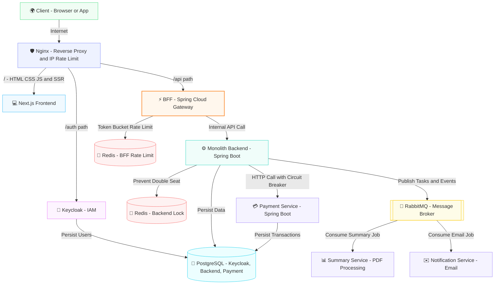
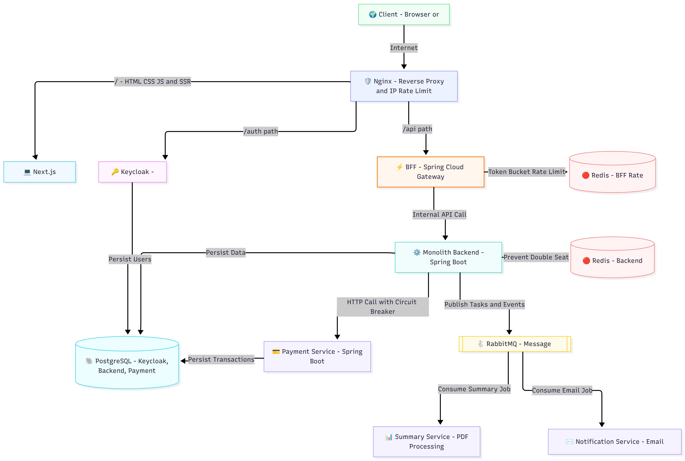

# UniHub Workshop - System Architecture Design

This document details the architectural design, component responsibilities, and routing strategies for the **UniHub Workshop** system.

---

## 1. Architectural Decisions & Design Patterns

The architecture is built on modern distributed system principles to ensure reliability, scalability, and security:

* **Backend-for-Frontend (BFF):** Uses **Spring Cloud Gateway** as a mediator between the client and internal services. It handles authorization validation and client-specific request orchestration.
* **Circuit Breaker Pattern:** Implemented on the communication path from the **Backend Monolith** to the **Payment Service** using **Resilience4j** to isolate payment gateway latency/failures and prevent cascading system downtime.
* **Distributed Locking:** Uses **Redis (Backend Lock)** during workshop registration to ensure atomic ticket allocation, preventing overbooking (double seat).
* **Asynchronous Event-Driven Worker Pattern:** Heavy operations (e.g., PDF text summarization, email sending) are offloaded to asynchronous workers (**Summary Service** & **Notification Service**) via **RabbitMQ** to maintain low-latency HTTP response times.
* **Defense-in-Depth Rate Limiting:** 
  * **IP-based Rate Limiting** at the **Nginx** level to mitigate DDoS and brute-force attacks.
  * **User-ID-based Rate Limiting** (Token Bucket) at the **BFF** level using **Redis** to regulate API usage per account.

---

## 2. System Architecture Diagram

Below is the conceptual flow of the architecture:

---

## 3. Component Details & Responsibilities

### 3.1. Edge Layer

#### 🛡️ Nginx
* **Technology:** Nginx
* **Responsibilities:**
  * Serves as the public entrypoint for all traffic.
  * Terminates SSL/TLS certificates.
  * Directs routing based on path (Frontend UI vs. Authentication vs. Business APIs).
  * Enforces **IP-based Rate Limiting** to protect internal components from scraping and denial-of-service attacks.

---

### 3.2. Presentation Layer

#### 💻 Next.js Frontend
* **Technology:** Next.js (React Framework, SSR & CSR)
* **Responsibilities:**
  * Serves client-side web application bundle.
  * Executes Server-Side Rendering (SSR) for SEO optimization.
  * Routes client API calls to the `/api/*` path, which is handled externally by the BFF.
  * Accesses backend APIs from the server node internally via `http://bff-gateway:8081`.

#### 🔑 Keycloak (Identity & Access Management)
* **Technology:** Keycloak (OAuth2 / OpenID Connect Identity Provider)
* **Responsibilities:**
  * Handles authentication, user registration, and single sign-on (SSO).
  * Issues cryptographically signed JSON Web Tokens (JWT) to clients.
  * Persists realms, clients, credentials, and user data in the shared **PostgreSQL** cluster.

---

### 3.3. Gateway & Routing Layer

#### ⚡ BFF - Backend for Frontend
* **Technology:** Spring Cloud Gateway (Spring Boot / Java)
* **Responsibilities:**
  * Intercepts incoming API calls (`/api/*`), decodes and validates JWT signatures.
  * Manages **User-ID-based Rate Limiting** using a **Token Bucket** algorithm backed by **Redis (BFF)**.
  * Acts as a single entrypoint for backend APIs, routing traffic to corresponding services.
  * Decouples the frontend from backend microservice API changes.

---

### 3.4. Core Business Layer

#### ⚙️ Monolith Backend
* **Technology:** Spring Boot (Java)
* **Responsibilities:**
  * Manages core domain entities (Workshops, Enrollments).
  * Executes reservation validation.
  * Prevents concurrent double-booking of seats using distributed locks in **Redis (Backend)**.
  * Connects directly to the **PostgreSQL** database to read/write workshop and registration state.
  * Initiates HTTP payment commands to the **Payment Service**, protected by a **Resilience4j Circuit Breaker**.
  * Offloads heavy operations by publishing event payloads (e.g. PDF tasks, confirmation notifications) to **RabbitMQ**.

#### 💳 Payment Service
* **Technology:** Spring Boot (Java)
* **Responsibilities:**
  * Handles payment gateway integration (Stripe, Momo, VNPay, bank transfers).
  * Manages transaction life-cycle, webhooks, and status checks.
  * Records payment logs and statuses in the shared **PostgreSQL** instance.
  * Operating as a standalone service to isolate payment processing vulnerabilities.

---

### 3.5. Asynchronous Workers Layer

#### 📊 Summary Service
* **Technology:** Python (or Go / Node.js)
* **Responsibilities:**
  * Listens to the `summary-queue` on **RabbitMQ**.
  * Extracts text from uploaded workshop PDF documents and generates automatic abstracts/summaries.
  * Performs compute-heavy tasks out-of-band to prevent slowing down the client HTTP threads.

#### ✉️ Notification Service
* **Technology:** Go (or Spring Boot / Node.js)
* **Responsibilities:**
  * Listens to the `notification-queue` on **RabbitMQ**.
  * Sends email receipts, registration confirmations, and reminders.
  * Integrates with external SMTP or transactional email providers.

---

### 3.6. Infrastructure & Storage Layer

| Component | Technology | Primary Purpose |
| :--- | :--- | :--- |
| **Redis (BFF)** | Redis (Key-Value) | Tracks token-bucket quotas for User-ID rate limiting. |
| **Redis (Backend)** | Redis (Key-Value) | Stores distributed locks to prevent double-booking. |
| **PostgreSQL** | PostgreSQL (Relational) | Stores persistent relational data (`keycloak_db`, `backend_db`, `payment_db`). |
| **RabbitMQ** | RabbitMQ (Message Broker) | Coordinates asynchronous jobs (`summary-queue`, `notification-queue`). |

---

## 4. Key Execution Flows

### 4.1. Workshop Registration & Booking Flow
1. **Client** submits a registration request to `/api/v1/registrations`.
2. **Nginx** forwards the request to **BFF**.
3. **BFF** validates user credentials and applies the **User-ID Rate Limiter** via **Redis (BFF)**. If successful, forwards to **Backend**.
4. **Backend** acquires a distributed lock in **Redis (Backend)** using the `workshop_id` and `seat_no`.
5. If lock is acquired and seat is available, the seat is temporarily reserved. Lock is released.
6. **Backend** initiates a payment request to the **Payment Service** (via a Circuit-Breaker protected client).
7. Once payment succeeds, **Backend** persists the registration in **PostgreSQL**.
8. **Backend** publishes an event to **RabbitMQ** to trigger a confirmation email.
9. **Notification Service** consumes the event and sends the email.

### 4.2. Routing Strategy Table (Nginx)

| Path | Destination Service | Internal Endpoint | Authentication | Rate Limit |
| :--- | :--- | :--- | :--- | :--- |
| `/` | Next.js Frontend | `http://frontend:3000` | No | IP-based |
| `/auth/*` | Keycloak | `http://keycloak:8080` | Managed by Keycloak | IP-based |
| `/api/*` | BFF (Spring Cloud) | `http://bff-gateway:8081` | JWT validated at BFF | IP-based + User-based |